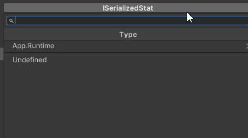

# Type Codebase

This package aims to provide an unified way to treat heavy queries on Assemblies and Types.

## Why?

Fetching assemblies and types on heavy project can quickly become really heavy and make your soft/tools slow. By coupling a query and cache system, you can execute the same query multiple times at different place during your development without caring your own cache system.

## Usage

### Assembly Codebase

- Ensure to cache all assemblies in an unique type array so there is no more allocations during `AppDomain.CurrentDomain.GetAssemblies()` calls.
- Cache assembly full name
- Cache assembly short name version (generally really slow) (`Assembly.GetName().Name`)

### Type Query

Use `TypeQueryManager.Query(myQuery)` to execute types query. All queries are cached. Queries comparison are based on what they do. So if you make a new instance of query doing the exact same thing of another query, you will get the cache result.

Queries comparison are based on HashCode, that are generated according to the parameter of the query.

#### "Type Query" types

- `GetAllTypesFromAssemblyQuery`: Query all types from an assembly
- `FilterQuery`: Apply a combination of filters ("Filter Query") on a query source to get only what you want. You can see it as a `System.Linq.Where` function.

#### "Filter Query" types

- `IsAssignableFromFilter`: Only types that inherit from the type used in the constructor will pass.

- `TypeUsageFilter`: Only the types that match the `ETypeUsageFlag` will pass. Supports:

  - Class

  - Struct

  - Abstract

  - Interface

  - Generic

  - ForbidUnityObject (So type that inherit from UnityObject cannot be selected)

    

  ##### Examples

  - Return all types from an assembly:

    `TypeQueryManager.Query(new GetAllTypesFromAssemblyQuery(assembly))`

  - Return all types from an assembly that are class or structs and are assignable from `MyStruct`:

    ```csharp
    TypeQueryManager.Query(
        new FilterQuery(new GetAllTypesFromAssemblyQuery(assembly),
                        new IsAssignableFromFilter(typeof(MyClass)),
                        new TypeUsageFilter(ETypeUsageFlag.Class | ETypeUsageFlag.Struct))
    );
    ```


## Customize

### Implementing new Type Query

- Inherit from `BaseTypeCodebaseQuery`
- Implement `CacheResults` where you execute the operation. It will be called only when necessary.
- Set a unique id for `QueryTypeId`. Look at other queries to ensure the id is not already used.
- Override `GetHashCode` and generate a new HashCode by combining the query type id and parameters of your query to ensure its uniqueness. It is really important because it is what defines if the query has already been executed and results can get from the cache.

### Implementing new Type Filter

- Inherit from `ITypeFilter`
- Implement `Filter` and return a filter for types passed as parameters.
- Override `GetHashCode` and generate a new HashCode by combining a filter id and parameters of your query to ensure its uniqueness. It is really important because it is what defines if the query has already been executed and results can get from the cache.

## TypeSelectorGUI

It is a button for EditorGUI to select a type, according to a list of constraint. Types queries are based on the type codebase and generation is async (but not the search system!).



## Usage

```csharp
TypeSelectorGUI.Draw(position, property, new TypeSelectorAdvancedDropdown.Settings()
{
    ConstraintType = TypeSelectorGUI.TryLoadTypeFromManagedReference(property),
    UsageFlags = ETypeUsageFlag.Class | ETypeUsageFlag.ForbidUnityObject
})
```

`ConstraintType` is the base class of the types that can be selected. If your property is a `SerializeReference` with a base class type, you can use `TypeSelectorGUI.TryLoadTypeFromManagedReference(property)` to assign this type to the constraint type.

For advanced purposes, you can also use directly `TypeSelectorAdvancedDropdown` to use the dropdown anywhere you want. Subscribe to `OnTypeSelected` to get the result but be careful that this is not called during the same frame that the draw! So you may have to defer the treatment you will do with the result.